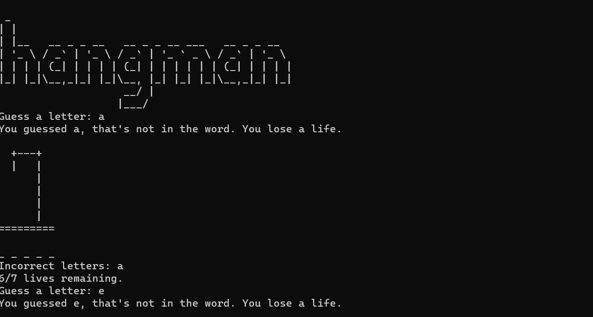

# Basic hangman game using python
### This is a basic hangman game where you have a certain number of tries to guess the random word
### This game runs on the CLI but uses ascii art to give some decent user experience



## File Structure:
### ascii_art.py → holds the ascii art for the hangman stages and  the hangman logo at the start
### random_words.py → holds the random words list for the game - contains 4597 unique values
### main.py → main file - holds the logic of the game

## How to install and get started:
### Copy the following commands to the CLI after you open it in your desired location
```powershell
git clone https://github.com/ShayCohenn/basic_hangman_game_python
```
```powershell
cd basic_hangman_game_python
```
```powershell
py main.py
```